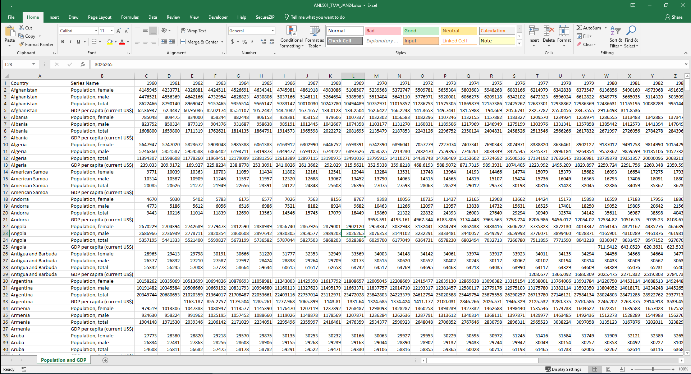
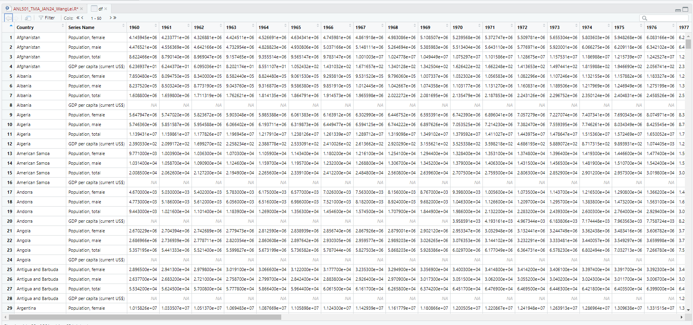
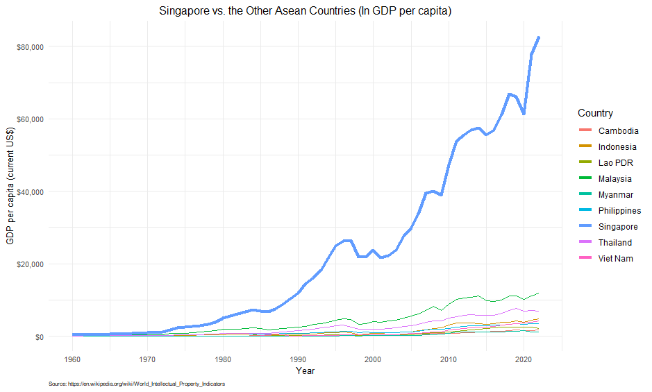
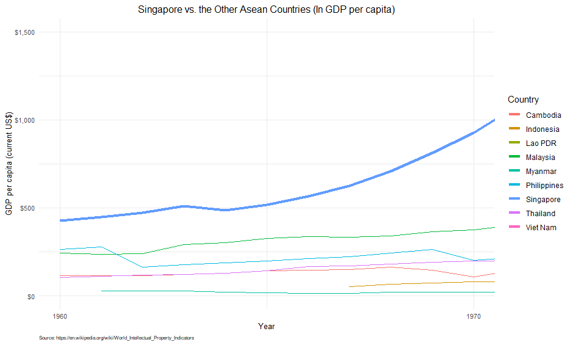
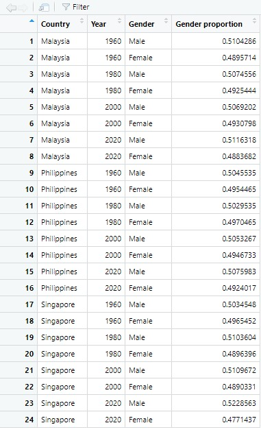
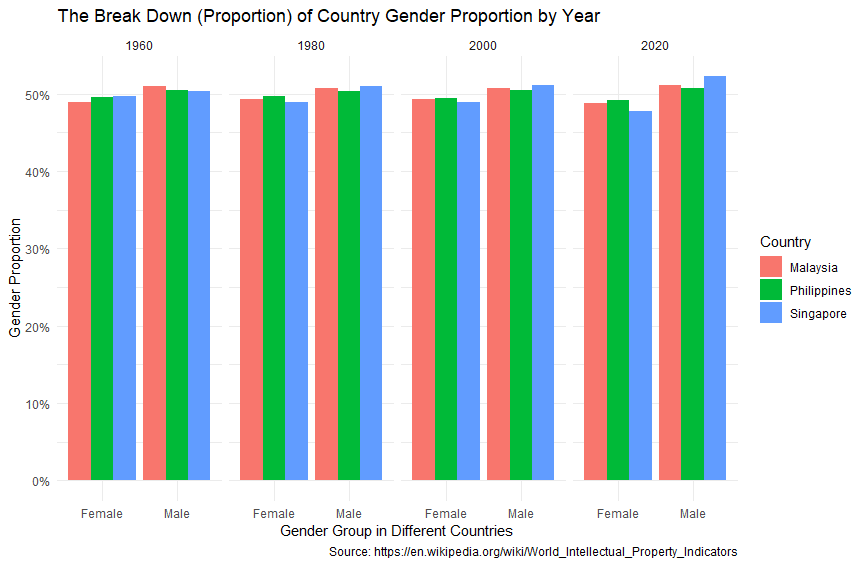
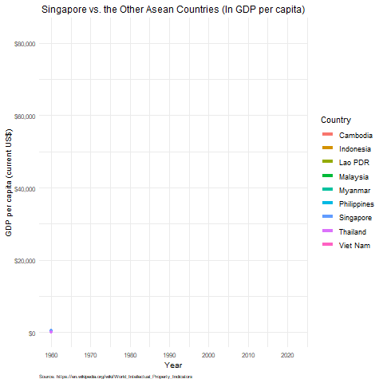

## Project 1: "Economic Growth and Population Dynamics: A Visual Story of Southeast Asia"

### Introduction:

The project delves into an in-depth analysis of demographic and economic indicators among Southeast Asian countries, using data from the "Population and GDP" worksheet of the 'ANL501_TMA_JAN24.xlsx' dataset. Understanding the complexity of cross-sectional, time-series, and panel data, I applied rigorous data visualization techniques to extract and highlight the region's growth and development patterns.

### Methodology:

**1. Data Import and Wrangling:**

To initiate this in-depth analysis project, I began with the importation and cleansing of the dataset named 'ANL501_TMA_JAN24.xlsx', specifically the "Population and GDP" worksheet. Utilizing R's `readxl` package, I extracted the necessary data, focusing on ASEAN countries, and performed rigorous data wrangling. This process involved filtering the dataset for relevant countries, ensuring that the data were sorted by both country and year, and restructuring the data into a longitudinal format. This meticulous organization set the stage for accurate and insightful analysis.

<em>ANL501_TMA_JAN24.xlsx (Source Data)</em>

<em>Dataframe (df.asean) in R</em>

**2. Data Analysis and Visualization:**

The essence of the analysis is a longitudinal scrutiny meticulously conducted to reveal the economic development of each country, with a focus on Singapore. Utilizing `ggplot2` in R, I crafted line charts through a series of visual comparisons that not only narrate Singapore's economic journey during key periods such as from 1960 to 1970 but also juxtapose it alongside neighboring countries, emphasizing the stark contrast in GDP per capita development and economic trajectories. These graphs precisely pinpoint key growth stages and economic turning points, providing a rich, context-oriented exploration of growth in the region.

<em>Singapore vs. the Other Asean Countries (1960 ~ 2020)</em>

<em>Singapore vs. the Other Asean Countries (1960 ~ 1970)</em>

**3. Gender Proportion Bar Chart:**

A focused demographic analysis was performed to determine the gender proportions within Malaysia, the Philippines, and Singapore for the years 1960, 1980, 2000, and 2020. Utilizing `geom_bar` with the `stat="identity"` parameter, I constructed bar charts that visually encoded the male-to-female ratios, offering an immediate understanding of demographic shifts. The data required pre-processing to accurately reflect these proportions and facilitate a side-by-side stacked representation for each gender category, enhancing the comparative clarity of the visualizations.

<em>The Dataframe after Pre-processing</em>

<em>The Break Down of Country Gender Proportion by Year</em>

**4. Data Animation with gganimate:**

The animation phase brought to life the static images through the use of the gganimate package. I selected a GDP per capita visualization for this purpose, aiming to dynamically showcase Singapore's growth against the backdrop of its ASEAN peers. The animated plot, rendered as a GIF file, was then smoothly integrated into the accompanying Word document. This visual narrative captured the temporal dimension of economic development, illustrating not only the endpoints but the entire journey.

<em>Singapore vs. the Other Asean Countries - Animation</em>

### Discussions and Observations:

The visualizations show a comparison between the GDP per capita of Singapore and other ASEAN countries over the years 1960 to 2022. The line plot shows the trend of GDP per capita for each country over the years. The line thickness and color of Singapore are used to differentiate its performance with the other ASEAN countries. 
Observing the plot, we see that Singapore's GDP per capita has been consistently higher than the other ASEAN countries throughout the years. The plot also shows that the GDP per capita of other ASEAN countries has been steadily increasing over the years, with some countries showing a sharper increase than others. 
The zoomed-in plot for the years 1960 to 1970 shows a clearer view of the differences in GDP per capita between Singapore and other ASEAN countries during that period. We can see that Singapore's GDP per capita was much higher than the other countries even during that time. 

Observing the plot, we see that the proportion of males and females in each of the selected countries has remained relatively stable over time. All three counties show a bigger proportion of males compared to females over the years.
In 1960, Singapore had a relatively equal proportion of males and females among these three countries.  The proportion of males in Singapore appears to have increased from 1980 onwards. This could be due to changes in immigration police, as Singapore has a large number of male foreign workers.
Another interesting observation is that there is a slight increase in the proportion of males in Malaysia from 2000 to 2020, and a similar increase in the proportion of males in Philippine from 1980 to 2020 as well.

My observations from the static visualizations revealed Singapore's remarkable economic ascent, particularly when contrasted with the varying paces of its neighbors. The gender demographic analysis illuminated nuanced population structures, reflecting broader social and economic trends. The animated visualization underscored the changing economic landscape of Southeast Asia, with Singapore's rise to affluence being a standout story that unfolded over the span of six decades.

### Skills and Tools:

Throughout this project, I honed my proficiency in R and fortified my expertise in data manipulation (using `dplyr`), data tidying (with `tidyr`), data visualization (through `ggplot2`), and animated storytelling (via `gganimate`). These tools were instrumental in translating raw numbers into compelling visual stories.

### Challenges and Resolutions:

Challenges arose from the need to maintain data integrity during the wrangling process, as well as in the creation of visualizations that accurately represented complex economic and demographic relationships. Through careful coding practices and iterative design, I ensured the visuals were both accurate and accessible. My resolution process involved consistent trial and error, refining techniques, and leveraging the power of R's visualization capabilities to overcome these hurdles.

### Conclusion:

This project is a testament to the capacity of data visualization to reveal and narrate the development journey of Southeast Asia. It highlights my ability to navigate complex datasets, extract meaningful insights, and present them in an engaging and informative manner. My portfolio now exemplifies a fusion of analytical precision and creative visualization, showcasing my dedication to transforming data into actionable intelligence. The insights yielded from this analysis serve as a powerful tool for policymakers, educators, and researchers interested in the socio-economic fabric of the ASEAN region.