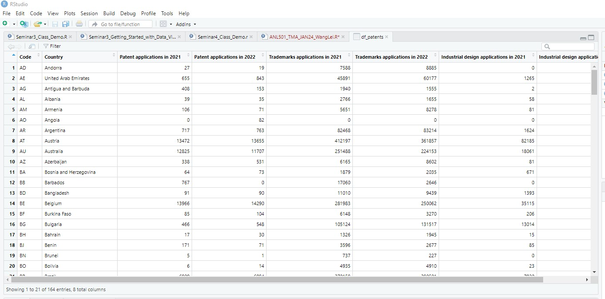

## Project 2: "Integrating Python with R for Data Scraping and Analysis: A Study on GDP and Innovation"

### Introduction:

This project demonstrates the powerful synergy between R and Python, two of the most prominent programming languages in data science. By harnessing Python's data scraping capabilities within RStudio, I extracted and analyzed World Intellectual Property Indicators from [Wikipedia](https://en.wikipedia.org/wiki/World_Intellectual_Property_Indicators) to explore whether there is cross-country evidence that GDP per capita is associated with total patents per 100 thousand population.

### Methodology:

**1. Python Integration:**

To bridge R with Python, I utilized the `reticulate` package, which provides a comprehensive set of tools for this purpose.
After ensuring Python was correctly installed on my system, I activated the Python interface within RStudio using `reticulate::repl_python()`.

**2. Data Scraping:**

Python’s `pandas` library's `read_html()` function was employed to scrape tabular data directly from the Wikipedia page.
I filtered the table with the heading “Patents, trademarks, and industrial design filing activity by country of origin” and saved the extracted data as `df_patents`.
The data was then exported to a CSV file, `patents.csv`, for further manipulation in R.
Data Import and Preparation in R:

<em>Data Set Extraction Using Python (`df_patents`)</em>

<em>Data Set Export into CSV (patents.csv)</em>

Imported the scraped data into R using the `read.csv()` command, ensuring continuity in data handling within a single environment.
To prepare for analysis, I joined the patent data with GDP per capita and population data from the provided 'ANL501_TMA_JAN24.xlsx' file.
After that, computed the total patents per 100 thousand population by summing the patents for the years 2021 and 2022 and adjusting for population size.

<em>The Final Merged Dataframe for Plotting</em>

**3. Visualization and Analysis:**

Utilizing R's 'ggplot2' package, visualization is created to investigate the association between GDP per capita and total patents per 100 thousand population.
The visualization was refined with careful adjustments to improve readability and aesthetic appeal, including scaling, theming, and labeling.
The analysis provided a compelling visual representation of the relationship between a country's wealth and its innovation output.

<em>Relationship Between GDP per Capita and Patents per 100,000 Population</em>

### Results and Discussion:

The finalized plot revealed a noticeable trend suggesting a positive correlation between GDP per capita and the number of patents filed per 100,000 people, signifying that higher income levels or wealthier countries may indeed be associated with increased innovation. However, the plot also indicated some outliers and variations, which suggests that while there is a general trend, there are also country-specific factors at play. This pattern was consistent with economic theories that link financial resources to enhanced research and development activities.

### Skills and Tools Used:

- RStudio and Python: Showcased the ability to operate within a dual-language coding environment.
- Package `Reticulate`: Demonstrated the seamless integration of Python within an R-centric workflow.
- Pandas and Data Manipulation: Highlighted skills in data collection and preprocessing.
- Data Visualization: Employed advanced techniques to represent complex data sets clearly and compellingly.

### Challenges Overcome:

The main challenge I faced in the project was ensuring seamless communication between R and Python, which was essential, especially for maintaining data integrity during transfer. This required meticulous debugging and thorough validation at every step to guarantee the accuracy of the final dataset for analysis. Encountered challenges also included mastering the reticulate package in R for interoperability with Python and ensuring that data merging processes were precise. Overcoming these hurdles not only honed my skills in multi-language programming but also deepened my understanding of the intricacies involved in data cleaning and transformation. Through this process, I developed a robust approach to manage and manipulate datasets across different programming environments effectively.

### Conclusion:

The successful integration of Python and R in this project has driven the development of the project through the application of skills across disciplines. The challenge of ensuring data fidelity through the pipeline between R and Python was a learning curve that greatly enhanced my multilingual programming abilities. The use of mesh packages, in particular, demonstrates the potential for simplifying complex workflows in data science with multiple coding languages. Proficiency in data manipulation, coupled with proficiency in the use of advanced visualization techniques, deepens understanding not only of data analysis, but also of the practical aspects of integrating various technical tools for robust data science practices.

On the other hand, through the investigation, the positive relationship between economic prosperity and innovation is revealed. It is clear from the visual analysis that countries with higher per capita GDP are more inclined to IP creation, as evidenced by their patent filings. This finding is consistent with the economic hypothesis that good financial health is a precursor to productive R&D efforts. The insights gleaned from this study may lead policymakers and business leaders to recognize the critical importance of investing in economic development as a strategy to foster an innovative environment. In future research, exploring more nuanced aspects of this relationship may yield further valuable insights into the mechanisms of innovation in different economic contexts.