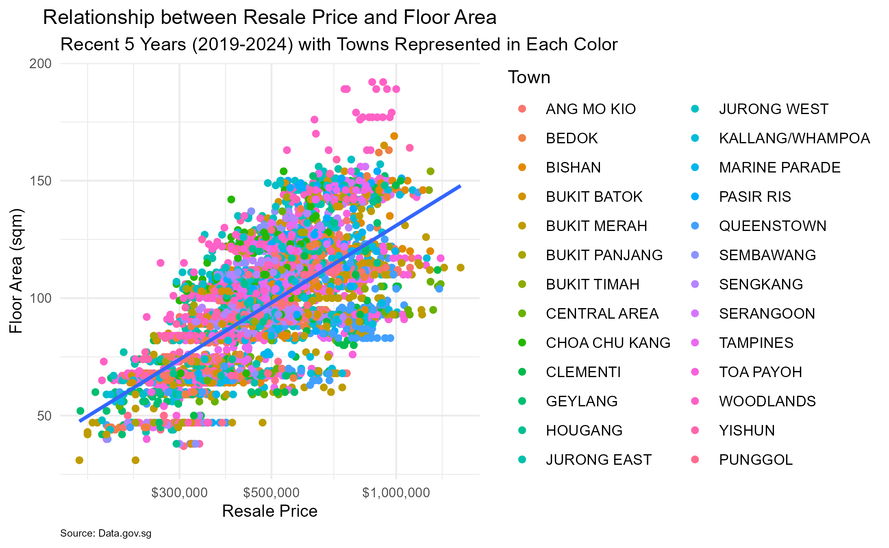
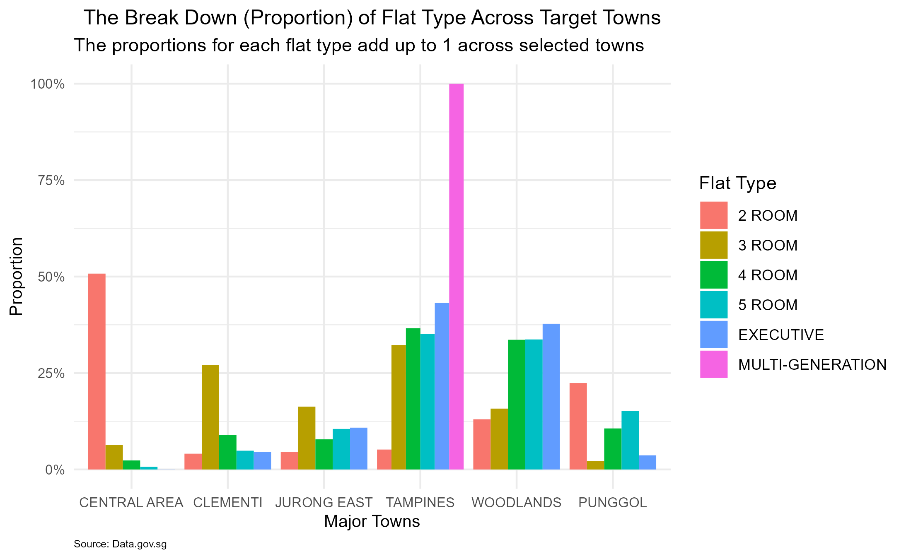
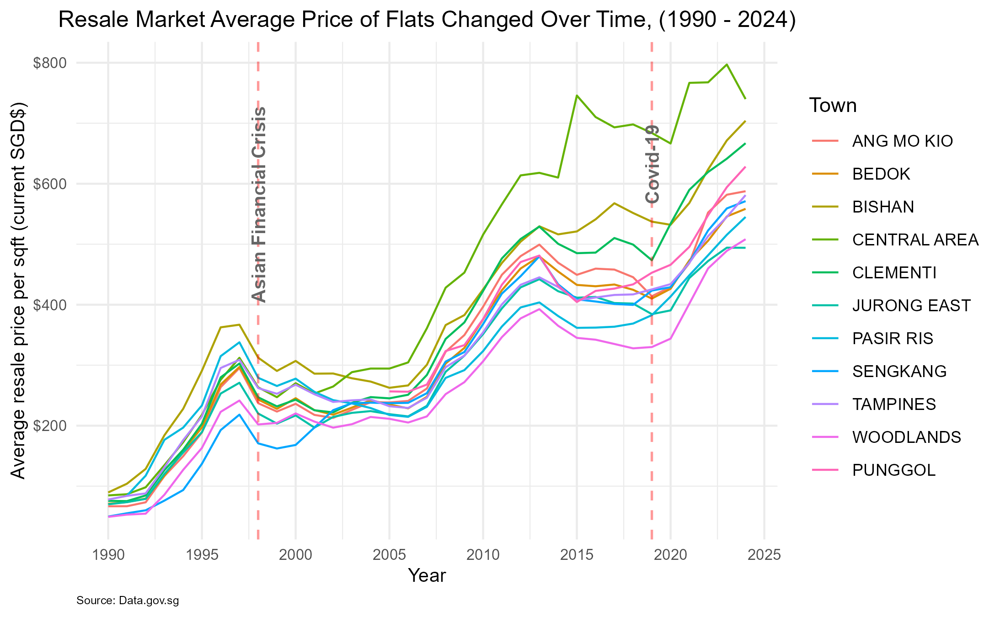
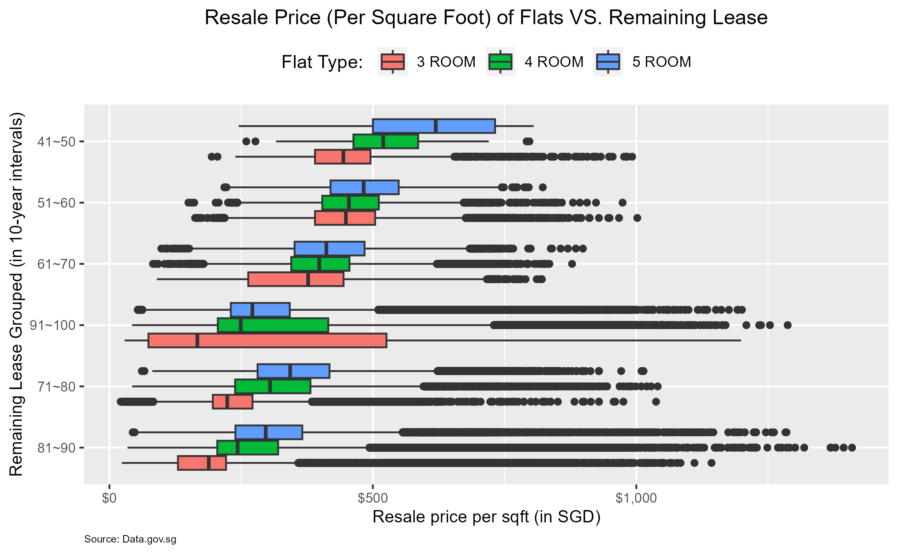
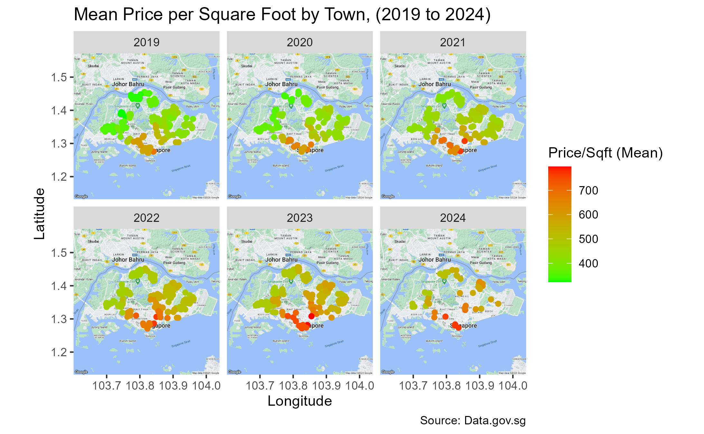

## Project 3: The Singapore HDB Resale Market: 1990-2024


### 1. Executive Summary:

This report explores the characteristics and quality of a combined dataset containing 920,127 records of real estate transactions in Singapore from 1990 to 2024. The objective of this report is to provide insights into the dataset and explore potential trends and events that may have affected the HDB resale market. Key findings include the identification of general characteristics of the data, including the 11 variables and chronological order of the records, as well as potential areas of further analysis related to trends over time and the impact of major events on the market.


### 2. Introduction:

The resale market in Singapore is a vital sector of the economy, and the HDB resale market plays a significant role in shaping this sector. This report aims to provide insights into the HDB resale market from 1990 to 2024, exploring potential trends and impacts of significant events on the market. The report summarizes the general characteristics of different datasets, explores the quality of the data, and analyzes the variables and observations.


### 3. Data Extraction:

Below is the resale HDB dataset to be explored. Use read_csv() function to extract the relevant .csv files and derived `df1`, `df2`, `df3`, `df4` and `df5`. The data frames will be further converted into tibbles using `as_tibble()` function, which are enhanced with modern features for ease of use and compatibility with tidyverse ecosystem.
The Singapore HDB Resale Market: (1990-2024)
- Resale Flat Prices (Based on Approval Date), 1990 - 1999
- Resale Flat Prices (Based on Approval Date), 2000 - Feb 2012
- Resale Flat Prices (Based on Registration Date), From Mar 2012 to Dec 2014
- Resale Flat Prices (Based on Registration Date), From Jan 2015 to Dec 2016
- Resale flat prices based on registration date from Jan-2017 onwards
- (Source: https://beta.data.gov.sg/collections/189)


### 4. Data Cleaning and Data Wrangling

**4.1 Data type convertion & new columns creation**

Perform data cleaning task by converting data type of variables in different data frames (df1 to df5) on specific time periods. This can facilitate subsequent data analysis and visualization. In details, convert variable $month, town, flat_type, flat_model and remaining_lease using as.Date(), as.factor() and as.numeric functions.
Due to comparison with df4 and df5, there are missing variables remaining_lease in data frame df1, df2 and df3. Hence, create the New Column ‘remaining_lease’ for ‘1990-1999’, ‘2000-2012’ and ‘2012-2014’ respectively. In the end, merge all five data frames and save it as df.all, using rbind() function.
Perform some data checking through glimpse() and sum() function, to ensure the data frame is appropriate for further analysis.


**4.2 Creation of new column:**

As of now, the dataset contains 11 variables and 920,127 observations, spanning monthly from 1990 to 2024. The records are sorted chronologically, allowing for analysis of trends over time. The variables include information on the year-month of the transaction (month), town, flat type, block, street_name, storey_range, floor_area, flat_model, lease_commence_date, remaining_lease, and resale_price. It is also important to check for the quality of the data included verifying data types and ensuring there were no missing values. As in practical statistic purpose, normally price per square meter / price per square foot is also necessary component for the measurement. Hence, we will calculate and created an new column named price_per_sqft(commonly usage in Singapore than price_per_sqm) in the overall data frame. As below:

```r
df.all <- df.all %>%
  mutate(price_per_sqft = df.all$resale_price / (df.all$floor_area_sqm * 10.7639)) 
```


### 5. Data Analysis and Visualisations

Once we have the appropriate data frame, we can begin addressing practical issues by analysis the derived data frame. This data set enables us to analyze and visualize a lot of information, empowering us to deliver valuable insights to our audience. Below, I will outline five scenarios where we can apply the data for problem-solving and visualization.

**5.1 The Relationship between Resale Price and Floor Area:**

#### 5.1.1 General characteristics of the data:
- Firstly, from the major data frame df.all, columns to be concerning: resale_price, floor_area_sqm, town and month.
- Secondly, consider to capture information over a recent 5-year period with extract only from 2019 to 2024 from month.

#### 5.1.2 Work done to check for the quality of the dataset:

- Base on the extracting subset df1.subset, check and found the observations quantity is huge (eg. 130,000+ no.s);
- A subsample of 5000 observations will extracted;
- Use glimpse() function to check the output dataset’s structure and contents along the steps.
  
#### 5.1.3 Overview of the variables and observations:
•	There are 12 variables in df1.sample data frame, in which we interested in: resale_price, floor_area_sqm, town and month columns.
•	The observations representing estate transactions (5000 no.s) associated with the selected variables.

#### 5.1.4 The main part of the code and drawing results are as follows:

```r
# Extract subset 
df1.subset <- subset(df.all, year(month) >= 2019)

# Extract sample observations
df1.subsample <- df1.subset[sample(nrow(df1.subset), 5000), ]

# Setting up plot
p1 <- ggplot(data = df1.subsample,
             mapping = aes( x = resale_price, y = floor_area_sqm))

# Complete plot 
p1 + geom_point(mapping = aes(color = town)) +  
  geom_smooth(method = "lm", se = FALSE) + 
  scale_x_log10(labels = scales::dollar)  # Format x-axis in logarithmic scale with SG dollar as unit
# ...... (refer to the details in RMarkdown)
```

<a href="https://airfire6518.github.io/portfolio/anl501_proj_3/img/1scatter.png">
    
</a>
<p style="margin-top: 0;"><em>Relationship between Resale Price and Floor Area</em></p>

#### 5.1.5 Exploratory Analysis (as above plotting):

In Summary, the plot presents a positive relationship between resale price and floor area, with potential variations across different towns. AS the floor area increases, there is a general trend of higher resale prices, as indicated by the upward slope of the linear regression line. The wide range of scatter points may suggest that there are other factors beyond also influence resale prices.

Next, we will look into the 2nd scenario …

**5.2 Flats Types Population in certain/Selected Towns**

#### 5.2.1 General characteristics of the data:

- Firstly, we know that we will study the information including housing units across various towns with flat types and their distribution.
- Secondly, each observation represents a housing unit, while we will choose variables of: town, flat_type.
- Furthermore, considering subset specific towns from town as df2.subset.

#### 5.2.2 Work done to check for the quality of the dataset:

- Firstly, examine the frequency and distribution of factor levels for both flat_type and town.
- During the examine process, found MULTI-GENERATION & MULTI GENERATION are representing the same level but with different names. To ensure the data is consistent and aligned, align them as MULTI-GENERATION.

#### 5.2.3 Overview of the variables and observations:

- There are 12 variables in df2.subset data frame, we interested in : town, flat_type columns;
- Here flat_type denotes the specific type of housing unit (eg.1 ROOM, 2 ROOM, …, MULTI-GENERATION);
- `town` is also factor data type here;
- The observations representing estate transactions (220,000+ no.s) associated with town and flat_type variables.

#### 5.2.4 The main part of the code and drawing results are as follows:

```r
# Align the factor level
levels(df.all$flat_type)[levels(df.all$flat_type) == "MULTI GENERATION"] <- "MULTI-GENERATION"

# Subset the data set based on specific towns
df2.subset <- subset(df.all, town %in% c("WOODLANDS", "PUNGGOL", "TAMPINES" ,"CENTRAL AREA", "CLEMENTI", "JURONG EAST"))

# Setting up plot
p2 <- ggplot(data = df2.subset, mapping = aes(x=town, fill = flat_type))

# Complete plot - Bar chart
p2 + geom_bar(position = "dodge",
              aes(y = ..prop.., group = flat_type)) +
     scale_y_continuous(labels = scales::percent)
# ...... (refer to the details in RMarkdown)
```

<a href="https://airfire6518.github.io/portfolio/anl501_proj_3/img/2bar.png">
    
</a>
<p style="margin-top: 0;"><em>The Break Down (Proportion) of Flat Type Across Target Towns</em></p>

#### 5.2.5 Exploratory Analysis (as above plotting):

Overall, the plot displays a comprehensive view of how different flat types transactions are distributed across specific towns. In practical, we may choose different towns to fit here as our demands. From the plot, we understand how certain types of flats are more prevalent in specific areas relatively. A higher proportion of certain flat types within each town compare to another may signify a correlation between housing preferences and town characteristics. The distribution may also reflect other factors, such as affordability, lifestyle preferences, or demographic compositions.

Furthermore, we will look into the 3rd scenario …

**5.3 The Average Pirce (per sqft) of Flats Changes Over Time:**

#### 5.3.1 General characteristics of the data:

- Firstly, from the major data frame df.all, we will focus on the average price per square foot over a time span from 1990 to 2024.
- Secondly, consider to capture information on month, town, price_per_sqft.

#### 5.3.2 Work done to check for the quality of the dataset:

- To ensure the quality of dataset, subseting specific towns (here we chosen 12 towns as consideration) and columns of month, town, price_per_sqft;
- Base on the extracting subset dfs.subset, we extract year from month variable as numeric data type;
- Form group “town-year” and subsequently to derive the mean calculation, which will contribute to a comprehensive overview of the average prices over time.
- Use glimpse() and class() function to check the output the structure of dataset, contents and data type along the steps.

#### 5.3.3 Overview of the variables and observations:

- There are 3 variables in df3.mean data frame: town, year, mean_price_per_sqft.
- The new df3.mean data frame is formed by group_by() and summarize() function. With this condensed set of data frame, we can quickly and efficiently to obtain the final plotting graphic.
- The observations representing estate transactions (368 no.s) associated with the selected variables.

#### 5.3.4 The main part of the code and drawing results are as follows:

```r
# Subset the dataset based on selected towns
df3.subset <- subset(df.all, town %in% c("WOODLANDS", "PUNGGOL", "TAMPINES" ,"CENTRAL AREA", "CLEMENTI", "JURONG EAST", "BEDOK", "BISHAN", "SENGKANG", "QUEESTOWN", "ANG MO KIO", "PASIR RIS"))

# Select the necessary columns
df3.subset <- df3.subset[c("month", "town", "price_per_sqft")]

# Extract the year from the month column
df3.subset$year <- year(df3.subset$month)

# Group the data by town and year, then calculate the mean price per sqft
df3.mean <- df3.subset %>%
  group_by(town, year) %>%
  summarize(mean_price_per_sqft = mean(price_per_sqft))

# Create a time series plot to visualize the average price of flats over time
p3 <- ggplot(data=df3.mean, aes(x=year, y=mean_price_per_sqft, color=town)) +
     geom_line(linewidth=0.5) 

# Add annotations for significant events
p3 + scale_x_continuous(breaks = seq(1990, 2025, 5)) +
     scale_y_continuous(labels = scales::dollar) +
     geom_vline(xintercept = 1998, linetype="dashed", size = 0.6, color="red", alpha = 0.4) +
     annotate(geom="text", x=1998, y=240, label="Asian Financial Crisis", 
              size=3.5, color="gray40", fontface="bold", angle=90, hjust=-0.5) +
     geom_vline(xintercept = 2019, linetype="dashed", size = 0.6, color="red", alpha = 0.4) +
     annotate(geom="text", x=2019, y=500, label="Covid-19", 
              size=3.5, color="gray40", fontface="bold", angle=90, hjust=-0.5) +  
# ...... (refer to the details in RMarkdown)
```

<a href="https://airfire6518.github.io/portfolio/anl501_proj_3/img/3line.png">
    
</a>
<p style="margin-top: 0;"><em>Resale Market Average Price of Flats Changed Over Time (1990 - 2004)</em></p>

#### 5.3.5 Exploratory Analysis (as above plotting):

In Summary, the plot demonstrates the association between the average resale price per square foot and time, revealing distinct trends for each specific town. By examining the entire time series, the long-term patterns seem to go upward, which might be indicative of broader economic or market trends. There are two impact of significant events which are the “Asian Financial Crisis” in 1998 and “Covid-19” in 2019. The annotations provide crucial insights. For instance, the Asian Financial Crisis annotation may coincide with a significant dip in prices per square foot, while the “Covid-19” annotation might align with a period of volatility.

Next, we will look into the 4th scenario …

**5.4 the Relationship between Remaining Lease of Flats and the Resale Price Per Square Foot**

#### 5.4.1 General characteristics of the data:

- Firstly, from the major data frame df.all, we will focus on: remaining_lease, resale_price_per_sqft, flat_type;
- Secondly, witin flat_type variable, we will extract 3 ROOM, 4 ROOM, 5 ROOM;
- Furthermore, consideration of the time span of the remaining_lease, categorical values to certain group (eg. 10-year interval) is necessary.

#### 5.4.2 Work done to check for the quality of the dataset:

- To ensure the quality of dataset, exclude those unnecessary data and form the subset df4.subset;
- Create an new column call remaining_lease_group, tidy up the values of the new column by group_by() function. Additionally, the values were renamed to provide clearer and more understandable labels. (eg. “(40,50]” is confused to be used as the label, and with its including 41 to 50 but not 40 to 50)
- Use glimpse() and class() function to check the output the structure of dataset, contents and data type along the steps.

#### 5.4.3 Overview of the variables and observations:

- The key variables here are: remaining_lease(numerical), price_per_sqft(numerical), and flat_type(categorical).
- The observations related to individual property transactions, where each entry represents a specific flat type, and its associated remaining lease period, and the corresponding resale price per square foot.

#### 5.4.4 The main part of the code and drawing results are as follows:

```r
# Extract subset
df4.subset <- df.all[c("remaining_lease", "price_per_sqft", "flat_type")]

# Filter the subset to include only specific flat types (3 ROOM, 4 ROOM, 5 ROOM)
df4.subset <- subset(df4.subset, flat_type %in% c("3 ROOM", "4 ROOM", "5 ROOM"))

# group remaining lease into 10-year intervals and rename values (eg. from "(40,50]" to "41~50")
df4.group <- df4.subset %>%
  mutate(remaining_lease_group = cut(remaining_lease, breaks = seq(40, 100, 10))) %>%
  group_by(remaining_lease_group) %>%
  filter(!is.na(remaining_lease_group)) %>%
  mutate(remaining_lease_group = ifelse(remaining_lease_group == "(40,50]", "41~50",
                                        ifelse(remaining_lease_group == "(50,60]", "51~60",
                                               ifelse(remaining_lease_group == "(60,70]", "61~70",
                                                      ifelse(remaining_lease_group == "(70,80]", "71~80",
                                                             ifelse(remaining_lease_group == "(80,90]", "81~90",
                                                                    ifelse(remaining_lease_group == "(90,100]", "91~100",
                                                                           remaining_lease_group)))))))

# Setting up the initial plot
p4 <- ggplot(data = df4.group,  
             mapping = aes(x = reorder(remaining_lease_group, price_per_sqft, na.rm=TRUE),  
                           y = price_per_sqft, fill = flat_type))

# Complete plotting - Boxplots to display the relationship
p4 + geom_boxplot() + 
  coord_flip() 
# ......(Refer to the details in RMarkdown file)
## NULL
```

<a href="https://airfire6518.github.io/portfolio/anl501_proj_3/img/4boxplot.png">
    
</a>
<p style="margin-top: 0;"><em>Resale Price (Per Square Foot) of Flatsw VS. Remaining Lease</em></p>

#### 5.4.5 Exploratory Analysis (as above plotting):

The plot displays the boxplots of resale price per square foot (in y-axis) across different intervals of remaining lease (grouped by 10-year each in x-axis). Each boxplot is filled with different colors representing specific flat types (eg. 3 ROOM, 4 ROOM, 5 ROOM). The boxplots provide insights into the central tendency, spread, and potential outliers for each interval. From the plot, it appears that flats with longer remaining lease periods tend to have higher resale prices per square foot compared to those with shorter remaining lease periods. Additionally, there might be variations in resale prices across different flat types within each remaining lease interval. The outliers also indicate that the price might depend on the location. The presentation allows for a clear understanding of the distribution of resale prices within each remaining lease interval, enabling comparison and identification of potential trends. Further exploration could involve conducting statistical tests or additional visualisations to further quantify the strength of the data association.

Next, we will look into the last scenario …

**5.5 Spatial Analysis of Real Estate Price Variations in Singapore: 2019 to 2024**

#### 5.5.1 General characteristics of the data:

- Firstly, for this scenario, we should focus on columns of mean_price_per_sqft(derive from resale_pirce), block, street_name and year.
- Secondly, since we have block and street_name, the spatial information could be formed.
- Then, by using geocoding method, coordinates information (latitude + longitude) can be obtained.
- Furthermore, plug all above dataset into ggmap() to complete spatial visualisation.

#### 5.5.2 Work done to check for the quality of the dataset:

- To ensure the quality of dataset, exclude those unnecessary data and form the subset df5.subset;
- Next, year information can be derived from month.
- Form group “town-year” and subsequently to derive the mean calculation, which will contribute to a comprehensive overview of the average prices over time (eg.2019 to 2024).
- Left-joining df5.subset with the new (group_by()) formed dataset to output the final subset df5.merge.
- Eventually, after the geocoding process using the OneMap API to obtain the coordinates, the spatial visualisation will be accurately implemented.
- Use glimpse() and head( ,n=100) function to check the output structure of dataset, contents and data type along the steps.

#### 5.5.3 Overview of the variables and observations:

- The key variables here are: mean_price_per_sqft, longitude, latitude and year.
- The observations related to individual property transactions, in which we extracted 1000 samples. Each entry represents a specific location.

#### 5.5.4 The main part of the code and drawing results are as follows: (OneMap API & ggmap() not diplaying here)

```r
# Subset by filtering the data
df5.subset <- df.all %>%
  select(month, town, block, street_name, price_per_sqft) %>%
  filter(month >= as.Date("2019-01-01"))

# Extract the year from the month column
df5.subset$year <- year(df5.subset$month)

# Group by "town-year" and calculate the average price per square foot
df5.avg <- df5.subset %>%
  group_by(town, year) %>%
  summarise(mean_price_per_sqft = mean(price_per_sqft, na.rm = TRUE))

# Merge the subset data with the calculated average price per square foot
df5.merge <- left_join(select(df5.subset, -price_per_sqft, -month), df5.avg, by = c("town", "year"))
# Loading the Map
ggmap(map) +
  geom_point(data = df5.join,
            aes(x = lng, 
                y = lat,
                color = mean_price_per_sqft)) +   # Mapping longitude, latitude, and color based on mean price per square foot
  scale_color_gradient(low = "green", high = "red") +  # Setting the color gradient for the points on the map
  facet_wrap(~ year, 
             labeller = label_parsed) +  # Faceting the plot by year
  labs(title = "Mean Price per Square Foot by Town, (2019 to 2024)",
       x = "Longitude",
       y = "Latitude",
       color = "Price/Sqft (Mean)",
       caption = "Source: Data.gov.sg") 
```

<a href="https://airfire6518.github.io/portfolio/anl501_proj_3/img/5map.png">
    
</a>
<p style="margin-top: 0;"><em>Mean Price Per Square Foot by Town</em></p>

#### 5.5.5 Exploratory Analysis (as above plotting):
It starts with data pre-processing, where the dataset is subsetted, aggregated, and merged to calculate the average price per square foot by month, town and year. Subsequently, we initiates geocoding using the OneMap API to obtain latitude and longitude coordinates information for the subset of address. Following by use of the ggmap() function to fetch a base map for Singapore from Google Map. The final segment demonstrates the spatial visualisation of mean price per square foot by different areas over the year 2019 to 2024 on the map. The spatial visualisations conducted in the previous code offer imperative insights into the distribution of real estate metrics. It’s feasible to provide a clear understanding of how the average price per square foot varies across different locations within Singapore over the specified time period. The color gradients facilitate the differentiation of price levels, as its identification of areas with higher or lower property values.

### 6. Conclusion:
Through the process of data analysis of the resale market of HDB dstaset from 1990 to 2024, it has revealed several important insights. These include the positive relationship between resale price and floor area, distinct distribution of flat type across specific towns, and the relationship between average resale price per square foot and time. Additionally, the impact of significant events such as the “Asian Financial Crisis” and “Covid-19” on resale prices has been highlighted. The findings provide valuable implications for understanding the HDB resale market in Singapore.The variation of resale prices across different flat types, remaining lease intervals, and specific towns indicates the influence of multiple factors such as housing preference, affordability, and market trends. Furthermore, the spatial visualisation of average price per square foot by different areas over the years 2019 to 2024 offers crucial insights into the distribution of the real estate metrics, enabling a clear understanding of the variations in property values across different locations within Singapore. The data analysis presented opens avenues for further research, including the more detailed exploration of the other factors that may influence resale price, and the impact of external events on the resale market.

