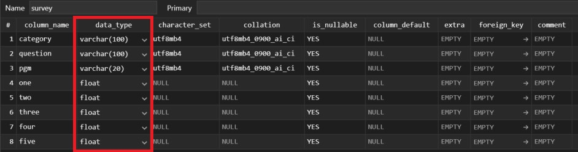
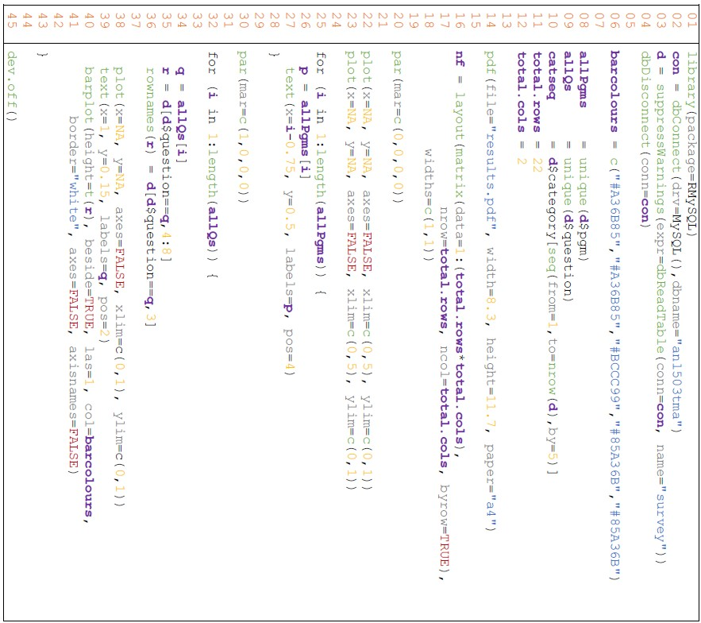
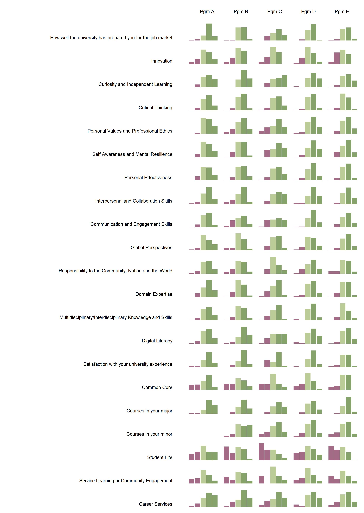
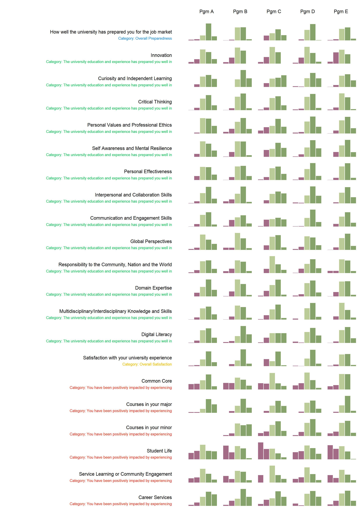
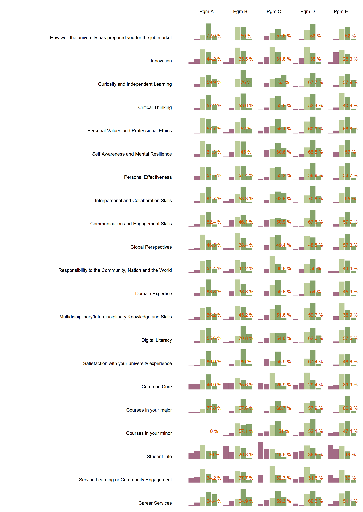

## Project 4: "Visual Analysis of University Graduate Survey Data"


### Introduction:

This project aimed to transform a dataset of graduate survey responses into a visual format that highlights key insights. The data, collected from five different programs, was analyzed to understand graduates' agreement with 21 core questions on a scale of 1 to 5. My role was to evaluate the data storage in MySQL, generate initial visualizations in R, and enhance these visuals with additional metrics for a comprehensive analysis.


### Data Evaluation and Optimization:

**Data Type Assessment:**

The survey data table was first evaluated for storage efficiency and appropriateness of data types.
I analyzed each column's data type, considering factors such as the range of values and the purpose of the data.

**MySQL Optimization:**

Utilizing the `ALTER TABLE` command, I optimized the data types where necessary to ensure that storage space was used efficiently without information loss.
I provided a justification for retaining the original data types where no changes were deemed necessary.

The SQL query as below:

```sql
ALTER TABLE survey 
  MODIFY category VARCHAR(100), 
  MODIFY question VARCHAR(100), 
  MODIFY pgm VARCHAR(20), 
  MODIFY one FLOAT, 
  MODIFY two FLOAT, 
  MODIFY three FLOAT, 
  MODIFY four FLOAT, 
  MODIFY five FLOAT;
```

<a href="https://airfire6518.github.io/portfolio/anl503_proj_1/img/Question_1a_datatype.jpg">
    
</a>
<p style="margin-top: 0;"><em>The revised dataset schema</em></p>


### Visualization Creation:

**R Script Analysis:**

I detailed the functionality of the R script segment provided by the question, which included the connection to the MySQL database, data retrieval, and the plotting process for the visualizations.
The explanation covered the loop structure that iterates over all programs and questions to generate individual bar plots for each.

The given R script segment:

<a href="https://airfire6518.github.io/portfolio/anl503_proj_1/img/Question_r_segment.jpg">
    
</a>
<p style="margin-top: 0;"><em></em></p>

For line 14 to line 45 in the R file - explaination:

Firstly (line 14 - 20), it sets up a PDF file for the final visualization stored later. The dimension in PDF is set width: 8.3 and height: 11.7 in A4 size paper.

Secondly (line 16 - 23), the `layout()` function will set up the arrangement of the matrix layout within. The `matrix()`constructs a matrix with specific dimensions, which will be calculated based on the total row number and total column number. The second parameter `width()` will set up the relative widths of the columns, `c(1, 1)` means equal width. 

The `par(mar= 0,0,0,0)` is used to set up margins to 0, meaning all margins will be removed. The two lines of the repeated `plot` function will initialize two empty base plots. Setting `x` and `y` to `NA` and `axes` to FALSE means creating a blank plotting environment primarily. The `xlim` and `ylim` will define the range of the plot area. The reason for having two repeated `plot()` commands is to create a grid of empty plot placeholders based on the specified layout.

Thirdly (line 25 - 30), the first for-loop is iterating through unique program names by their length and assigning them to variable `p`. The `text()` function will add labels within the loop. `x` and `y` will position the text labels, where `i-0.75` means inserting horizontally based on the loop index. The `labels` parameter will use the program name `p`, and the `pos` parameter will be used to locate the label. Overall, this helps to implement text labels for program names on the page.

Lastly (line 32 - 45), the second for-loop is iterating through unique questions by their length and assigning them to variable `q`. If the current `q` matches the variable `question` in data frame `d`, it will extract columns 4 to 8 (`one` to `five`) from the matching rows and assign the result to the new variable `r` (subset data frame).  The `rowname()` function will rename the row names for `r`.

Within the iteration, the plot will be generated by the configuration of the axis and the text label added. The `plot()` and `text()` settings are the same as the previous setting. The `barplot()` function will realize the bar plotting, in which the `height` parameter specifies the heights of bars. `t(r)` will transpose matrix `r`, the columns for `t(r)`are `PgmA` to `PgmE` and rows are `one` to `five`. Through the iteration, each set of `t(r)` will fill up the pre-define plotting area.

The parameter `beside` set to true displays the bars beside each other. The parameter `las=1` will set the axis labels to parallel with the axis. The `col` and `border` parameters will set the appearance of the bars. Both parameters `axes` and `axisnames` are set to FALSE meaning that the corresponding will not be displayed. 
The `dev.off()` closes the current activity. 

**Visualization Assessment:**

As below, I conducted a critical evaluation of the initial visualizations to identify their most significant weakness.
The justification for my assessment was based on visual best practices and the effective communication of data.

The given handout:

<a href="https://airfire6518.github.io/portfolio/anl503_proj_1/img/Question_visual.png">
    
</a>
<p style="margin-top: 0;"><em></em></p>

The final output PDF file contains a grid of bar charts and labels for program names and questions to provide a visualization solution. It demonstrates a comprehensive representation of student percentage distribution across 1 to 5 scales. However, in my opinion, the significant weakness is the potential for visual clutter and information overload due to the relatively sheer volume of all the bar charts (105 in total) packed into the A4-size paper. The dense arrangement of bar charts could make it challenging for users to discern specific patterns or trends, especially without a clear hierarchy or grouping of the data. Additionally, the small size of individual bar charts may hinder the legibility of the content, particularly for detailed analysis. 
To improve the visualization and make it more user-friendly, it is better to highlight key insights by applying color coding or annotations to certain critical information. Or consideration of organizing the bar charts by providing detailed information for the particular portions of the exploration.


### Enhancement of Visuals:

**Category Integration:**

Based on feedback, I enhanced the visualization by incorporating the question categories into the bar plots in a subtle and informative way.
I described the iterative process and the R programming techniques used to achieve this.

<a href="https://airfire6518.github.io/portfolio/anl503_proj_1/img/Question_1d_output.png">
    
</a>
<p style="margin-top: 0;"><em></em></p>

**Top-Two Box Metric:**

I further improved the visualization by implementing a "top-two box" metric that calculates the percentage of respondents who selected the two highest ratings.
The R program modifications made to include this metric were explained, along with commentary on how it provides additional insights into the data.

<a href="https://airfire6518.github.io/portfolio/anl503_proj_1/img/Question_1e_output.png">
    
</a>
<p style="margin-top: 0;"><em></em></p>


### Skills and Tools:

- Data Analysis and Programming Languages: Demonstrated strong capabilities in data analysis, particularly in the use of R for data visualization and statistical analysis. This was complemented by my proficiency in SQL for database querying and manipulation.
- Database Management: Showcased knowledge in managing and optimizing SQL databases, with a focus on MySQL. Employed best practices to ensure data integrity and efficient data retrieval.
- Data Visualization Tools: Utilized R's graphical capabilities, possibly through the 'ggplot2' package or base R plotting functions, to create compelling visualizations. This enabled the extraction and presentation of insights from the survey data.
- Integration of R and MySQL: Made use of the R's MySQL package to seamlessly connect R with the MySQL database, allowing for direct querying and data manipulation within the R environment.
- Optimization Techniques: Applied optimization techniques in both SQL and R to enhance performance and data handling. This included altering data types in MySQL to conserve storage and efficiently structuring R code for plotting.


### Challenges and Learning Outcomes:

- Data Integrity and Optimization: One main challenge was maintaining the integrity of the data while optimizing the storage in MySQL. This involved making critical decisions about data types without compromising the accuracy or granularity of the survey results.
- Visual Clarity: Another hurdle was designing visualizations that were not only aesthetically pleasing but also conveyed the necessary information clearly and concisely. This required iterative design and careful consideration of color schemes, layout, and labeling.
- Coding Efficiency: Improving the efficiency and readability of R code was also a focus, especially when iterating over multiple survey questions and programs to produce numerous plots.
- Learning Outcomes: Through these challenges, I gained a deeper understanding of the ramifications of data type decisions on storage and performance. I also learned how qualitative metrics like the "top-two box" score could be integrated into visualizations to provide meaningful insights. The project reinforced the critical role that thoughtful data visualization plays in interpreting complex datasets.
- Problem-solving Skills: Enhancing my problem-solving skills, particularly in debugging code and devising creative solutions to visualization challenges.


### Conclusion:

The project solidified my position as a versatile data analyst capable of transforming complex datasets into accessible and actionable insights. The visualizations I created offered the university a nuanced understanding of student satisfaction across various programs, facilitating data-driven decisions to enhance educational services. My approach to database and visualization optimization not only conserved resources but also elevated the analytics process. Through these efforts, I have shown that I can tackle both the technical and conceptual challenges inherent in data analysis, producing work that stands out for its clarity, utility, and technical soundness. The experience has been a testament to the power of combining analytical rigor with visual storytelling, and I look forward to applying these skills to future projects that require a deep understanding of both the data and its broader implications.