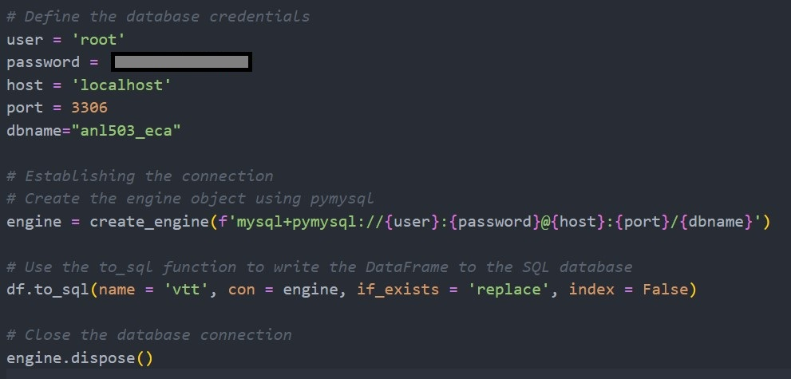
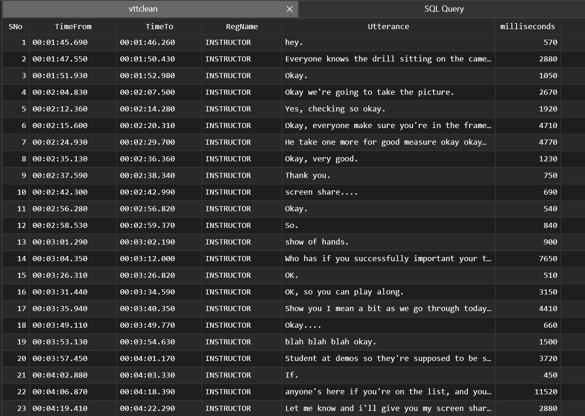
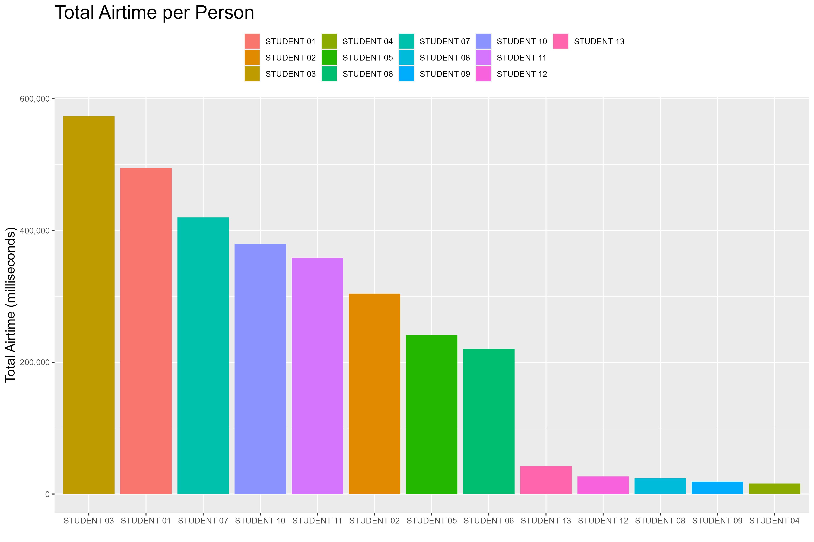

## Project 5: "Insights from Zoom Transcripts: Analyzing Student Engagement in the Digital Classroom"

### Introduction:

In a quest to elevate student engagement in virtual classrooms, I undertook a project that leveraged the power of data analytics to provide insights into participation levels during Zoom classes. With the shift to online education, it became paramount to understand and encourage student interaction. My goal was to transform auto-generated Zoom transcripts into a structured dataset that could be analyzed to inform engagement strategies.

### Data Processing and Database Integration:

**Transcript Parsing:**

Developed a Python program to parse the 'captured_dialogue.vtt' file, extracting structured data from the raw transcript text.
Employed regular expressions to accurately identify and separate different components of the transcript, such as serial numbers, timestamps, speaker names, and utterances.

**Database Table Creation:**

Using the extracted data, I created a MySQL table named ‘vtt’ with columns corresponding to the transcript's structure: SNo, TimeFrom, TimeTo, RegName, and Utterance.
The program ensured data integrity and correct formatting for direct database importation.

<em>Establishing Connection to SQL and Creating Dataframe</em>

### Data Enhancement and Analysis:

**Time Duration Calculation:**

Executed SQL operations to construct a new table, ‘vttclean,’ which included all columns from ‘vtt’ plus a new column for ‘milliseconds.’
The new column represented the duration of each utterance, providing a quantitative basis for subsequent analysis.

The details steps as below:
- Step 1: Converting the datatype in Schema
- Step 2: Create the `vttclean` table with a new column called `milliseconds` (with INT)
- Step 3: Insert data into `vttclean` with the `milliseconds` column calculated (`TimeTo` - `TimeFrom` in milliseconds)

<em>The New SQL Table ‘vttclean’</em>

**Visualization of Class Participation:**

Designed an R program to visualize the total airtime each student contributed during class, represented in milliseconds.
The bar chart created succinctly captured the level of participation, allowing for quick comparison and assessment of engagement.

<em>Total Airtime per Person</em>

### Skills and Tools Used:

- Python for Data Parsing: Efficiently processed and parsed the raw Zoom VTT transcripts using Python, employing regular expressions to identify and extract structured data. My code seamlessly translated unstructured text into a clean, organized format suitable for analysis.
- MySQL for Database Structuring: Using MySQL, I designed and populated a table to store the processed transcript data, demonstrating my expertise in handling and structuring data within relational databases.
- R for Data Visualization: Employed R's powerful graphical libraries to create insightful barcharts that quantified each student's participation by visualizing their total speaking time. This not only assessed engagement but also provided a graphical representation of class dynamics.

### Challenges Overcome:

- Data Extraction: The initial challenge was the extraction of data from a format not intended for database use. Developing a Python script with precise regex patterns ensured accurate data capture into a tabular form. Addressed the complexity of processing inconsistent and unstructured text data and converting it into a structured format suitable for database storage.
- SQL Table Enhancement: The inclusion of a 'milliseconds' column to quantify the duration of each speaking instance required careful SQL scripting to calculate and append this data without errors.
- Visual Clarity in Data Presentation: The final hurdle was creating an R visualization that was not only accurate but also intuitive. I developed a barchart that represented students' airtime in a manner that was easy to interpret, aiding in the identification of engagement patterns.

Through overcoming these challenges, I honed my data manipulation and visualization skills, reinforced the importance of precise data cleaning, and learned to present data-driven insights in a compelling visual format.

### Conclusion:

The project was a resounding success, providing clear metrics on student engagement that could guide the university in adapting teaching methods to the virtual environment. By transforming raw transcripts into a structured MySQL database and then into R-generated visualizations, I crafted a narrative of class participation that was both informative and accessible. This work stands as a testament to the potential of data analytics in enriching the educational experience and enhancing student interaction in online platforms.