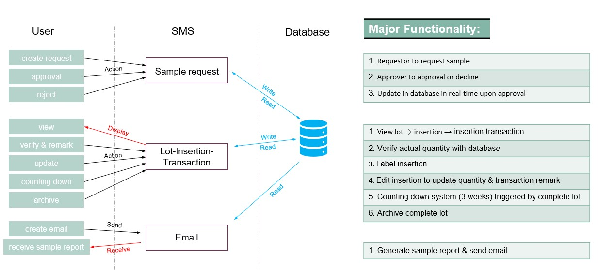
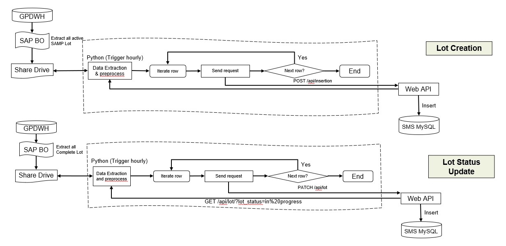
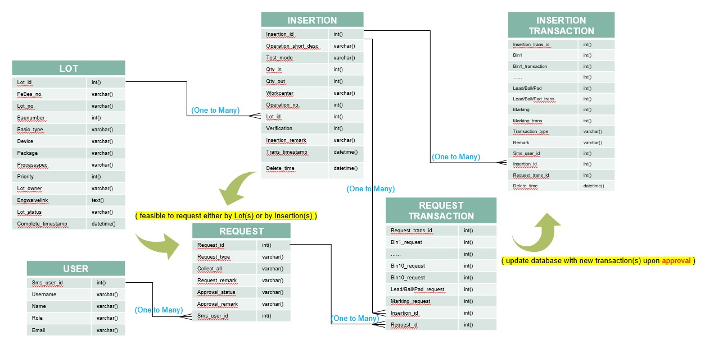
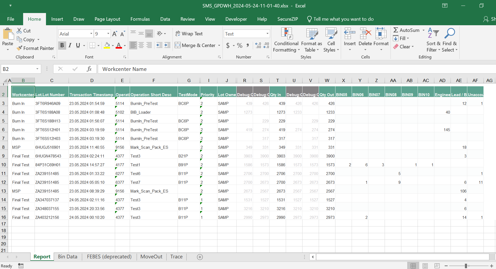
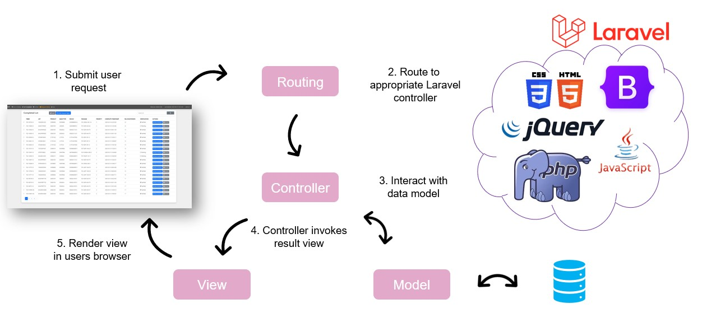
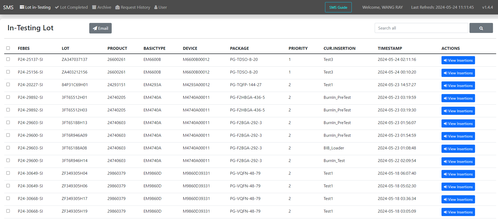

## "Sample Management System" - Infineon Technologies

#### Skillsets: Data Automation, MySQL, Python, Web API, SAP BO, Web based GUI, Laravel etc.

### Introduction:

The Sample Management team provides crucial support for the testing of engineering samples in Singapore. This encompasses samples at various stages, including early milestones samples, M8 assessments, qualification samples, and customer samples. Although the Camstar system effectively monitors all engineering sample (ES) lots during testing, there is a significant gap in tracking once lots are terminated from Camstar after testing. 

Consequently, a manual tracking process is conducted for the collection and disposition of rejected units, utilizing generic tools like Excel, Email, and paper documentation. As complexity of testing have increased, the current method has become unsustainable and is plagued by a heightened risk of human error due to its manual nature.

### Objective:

The objective is to digitize the process of monitoring ES lots after the Camstar testing phase, with a concurrent focus on augmenting the transparency of lot transactions both during and after the Camstar testing process.

### Methodologies:

Leveraging the Laravel framework, this project endeavors to construct a web-based user interface that serves as a centralized platform for exhibiting the current status of existing ES lots. Furthermore, this interface shall facilitate the tracking of transaction histories and engineer requests associated with these lots. The essential testing data pertinent to ES lots, as extracted from Business Object reports through Camstar Universal, constitutes a pivotal dataset for this interface. Notably, the Python programming language assumes a central role in the project's underlying framework, contributing to data refinement and process automation.

In tandem with these efforts, the project incorporates the utilization of MySQL as a foundational component, aimed at establishing a highly efficient and robust database. The integration of multiple tables within this database is designed to accommodate diverse functionalities within the Sample Management System (SMS). This strategic design ensures the system's capacity to seamlessly address various operational aspects and future scalability with increasing complexity.

<em>SMS Requirements & Architecture</em></em>

### Data Evaluation and Optimization:

**Enhancing Data Quality and Integrity with Python:**

The essence of data quality in our Sample Management System (SMS) was established by implementing a robust Python-based back-end processing system. Python's powerful libraries, such as Pandas and NumPy, were instrumental in data wrangling efforts that involved cleaning, transforming, and normalizing data. As part of the data evaluation phase, Python scripts were developed to perform various checks, such as validating data formats, ensuring mandatory fields were not missing, and checking for inconsistencies. Additionally, Python was utilized to extract and preprocess data from SAP Business Objects (SAP BO), where it served as an intermediary to filter, sort, and prioritize data before pushing it into the web API.

**Ensuring Consistency and Streamlining Data Flow:**

To maintain consistency across the data processing pipeline, we leveraged Python scripts to enforce business rules and logic, ensuring that data adhered to predefined schemas. This level of consistency was crucial when dealing with data from various sources, including local share drives where preliminary data was stored and manipulated using Excel. Furthermore, the scripts were scheduled to run at periodic intervals, fetching the latest data from the SAP BO reports, thus automating and streamlining the data flow from extraction to loading into the MySQL database via the web API.

**Optimizing Data Storage and Retrieval with SQL:**

The MySQL database was architected to support efficient data storage and retrieval, ensuring high performance as the complexity of testing and the volume of data grew. Normalization techniques were employed to eliminate data redundancy, which not only conserved storage space but also simplified data management. The database schema was designed to allow for the logical grouping of related data and to facilitate quick data retrieval operations.

**Indexing and Query Optimization Strategies:**

An indexing strategy was a key component in optimizing the database. Indexes were carefully created on columns that were frequently used in search criteria, join operations, or as part of the foreign key relationships. This greatly reduced the query execution time by allowing the database engine to quickly locate the data without having to scan the entire table. By indexing critical fields such as 'Lot ID' and 'Transaction Timestamp', the system was able to provide real-time status updates with minimal latency.

**Linking with Web API and SQL for Data Management:**

The web API served as the interface layer through which the front-end application interacted with the MySQL database. API endpoints were optimized for various CRUD (Create, Read, Update, Delete) operations, and they were designed to handle high-concurrency data transactions efficiently. Python's requests library was used to develop the API interaction layer, which facilitated seamless data communication between the front-end and the database. The combination of Python's data handling capabilities and SQL's data manipulation strengths allowed us to ensure that the SMS operated smoothly, reliably, and efficiently.

### Skills and Tools Used:

Throughout the development of the Sample Management System, a variety of skills and tools were employed to ensure the creation of a robust, efficient, and user-friendly application.

**Python for Data Manipulation and Automation:**

My expertise in Python was a cornerstone of the project, enabling sophisticated data manipulation and process automation. Utilizing the power of libraries such as pandas for data analysis and numpy for numerical computations, I was able to efficiently handle large datasets, perform complex calculations, and automate repetitive tasks. Python's versatility also played a pivotal role in developing scripts for extracting data from SAP Business Objects reports, transforming and sanitizing this data, and automating its flow into the system through API calls.

<em>SAP BO to SMS MySQL Dataflow Diagram</em>

**API Interactions:**

The seamless interaction with the system's back-end was facilitated through well-defined API endpoints. By leveraging the requests library in Python, I crafted a series of scripts that interfaced with the web API, allowing for automated data transmissions and updates that bridged the gap between the MySQL database and the user interface.

**SQL for Database Design and Querying:**

A profound understanding of SQL was instrumental in designing a structured and optimized database. By implementing a relational database schema in MySQL, I ensured efficient data organization and integrity. My SQL skills were further demonstrated through the writing of optimized queries, the creation of indexes to enhance performance, and the maintenance routines that kept the database at peak performance.

<em>Data Entity Relationship Diagram</em>

**Excel for Preliminary Data Handling:**

In the project's inception, Excel was utilized for initial data assessment and as a transitional tool for record-keeping. My ability to employ Excel functions and macros streamlined the early stages of data management. However, recognizing the limitations of Excel for scalable solutions, I migrated these processes to more robust, automated systems using Python and SQL.

<em>Export SAP BO to Excel Hourly</em>

**Laravel for Web Interface Development:**

The Laravel PHP framework was the chassis upon which the web-based user interface was built. My knowledge of Laravel's MVC architecture was instrumental in constructing a reliable, secure, and maintainable platform. It allowed for the effective management of the application logic, the user interface, and the database components which were integral for the system's operations.

<em>Web - MVC Architec</em>

**Front-End Technologies for Interactive Design:**

To create an engaging and responsive user interface, I harnessed the capabilities of front-end technologies including HTML5, CSS, JavaScript, and jQuery. These tools enabled me to craft a visually appealing design while maintaining a user-centric approach. The interactive elements and real-time feedback provided through these technologies greatly improved the user experience.

In conjunction, these skills and tools were deployed to craft a data-driven application that not only met the project's requirements but also established a foundation for future enhancements. By integrating these diverse technologies, I was able to deliver a system that was scalable, efficient, and poised for evolution in line with emerging business needs.

<em>SMS Web GUI - Main Page</em>

### Challenges Overcome:

The journey to develop the Sample Management System (SMS) was marked by several technical and user-related challenges, each requiring thoughtful strategizing and rigorous implementation to overcome.

**Managing Large Data Sets:**

Handling vast volumes of engineering sample data was a significant challenge. The primary strategy to manage this involved Python's robust data processing libraries. Scripts were optimized using vectorized operations and efficient data structures provided by pandas to minimize memory usage and maximize speed. Data was batch-processed to avoid overloading the system, ensuring the application could process large data sets without compromising on performance.

**Ensuring Real-Time Updates:**

The system demanded real-time data updates to reflect the current status of lot transactions. To achieve this, API endpoints were designed for maximum efficiency, leveraging Python's asynchronous programming capabilities to handle concurrent data streams. The backend was architected to process incoming data swiftly, making use of database triggers and stored procedures, which allowed stakeholders to view the most up-to-date information.

**Maintaining Data Integrity:**

Data integrity was paramount to the success of the SMS. Python scripts included validation checks to ensure that data conformed to expected formats and constraints before being committed to the database. During transmission, checksums and data hashing techniques ensured that any corruption of data was detected and handled. On the database side, transaction management in SQL was critical; transactions ensured that database operations were atomic, consistent, isolated, and durable (ACID properties), maintaining data integrity throughout the process.

**Preventing Data Corruption During Transmission:**

To prevent data corruption during transmission, robust error-handling routines were implemented within the Python scripts. These routines included retries for failed transmissions and logging of any anomalies encountered. Additionally, API transactions employed HTTPS protocols to ensure secure data transfer.

**SQL Transaction Handling:**

SQL transactions played a vital role in ensuring that batch operations did not result in partial updates, which could compromise the system's consistency. Implementing transaction scopes within the SQL operations ensured that either all changes were committed or rolled back if an error occurred. This ensured that the data remained in a consistent state, even in the event of unexpected failures.

**User Acceptance and Training:**

Transitioning users from manual processes to the new automated SMS posed challenges in user acceptance and training. To mitigate this, comprehensive training sessions were conducted, introducing users to the digital tools and processes incrementally. Interactive guides and training modules were developed, allowing users to familiarize themselves with the system at their own pace. Furthermore, user feedback was actively solicited and used to refine the UI/UX to better match the workflows they were accustomed to.

**Project Reflection:**

The challenges encountered during the development of the SMS were diverse and complex, but they were met with targeted solutions that not only resolved immediate issues but also fortified the system against future complications. Through focused effort on optimizing scripts, ensuring data integrity, and prioritizing user experience, the project was successfully delivered to meet the high standards required by the industry and the organization.

### Customer (Sample Management Team) Feedback:

A multifunctional website has been established to effectively streamline ES management processes. Its functionalities include: automated recording of binning data for each test insertion; comprehensive tracking of transaction history for physical ES units; facilitating ad-hoc requests to logistics operators for managing physical unit handling, monitoring of ES lot rejected units status; and automated email generation to report physical unit summaries of ES lots.

This advancement notably elevates the transparency, traceability, and data automation associated with ES lots. Moreover, the project effectively streamlines device handling procedures, leading to improved operational efficiency.

### Conclusion:

The Sample Management System (SMS) has fulfilled all initially defined project scopes. Throughout the system's development, the project team not only acquired a wealth of new technical knowledge but also honed their project management skills. Following the successful completion of the SMS's initial phase, numerous additional opportunities have come to the fore. For instance, the potential to extend the system's scope to encompass tasks associated with Incoming ES lots and Outgoing shipment logistics has been identified. Additionally, prospects such as Optical Character Recognition (OCR) for physical marking verification and Label printing for lot preparation have surfaced. All these noteworthy features will be thoroughly evaluated and integrated into the forthcoming second phase of system development. 

## Go to Other Related Data and Automation Projects:
> **R:** 
> <a href="https://airfire6518.github.io/portfolio/anl501_proj_1">Economic Growth & Population Dynamics: A Visual Story of Southeast Asia</a> 
> <a href="https://airfire6518.github.io/portfolio/anl501_proj_2">Integrating Python with R for Data Scraping and Analysis: A Study on GDP and Innovation</a> 
>
> **Python/R:** 
> <a href="https://airfire6518.github.io/portfolio/anl501_proj_3">The Singapore HDB Resale Market: 1990-2024</a> 
>
> **SQL/R:** 
> <a href="https://airfire6518.github.io/portfolio/anl503_proj_1">Visual Analysis of University Graduate Survey Data</a> 
>
> **Python/SQL/R:** 
> <a href="https://airfire6518.github.io/portfolio/anl503_proj_2">Insights from Zoom Transcripts: Analyzing Student Engagement in the Digital Classroom</a> 
>
> **Python/SQL/Web API/SAP BO/Web GUI/Laravel/PHP:** 
> <a href="https://airfire6518.github.io/portfolio/infineon_sms">"Sample Management System" - Infineon Technologies</a> 